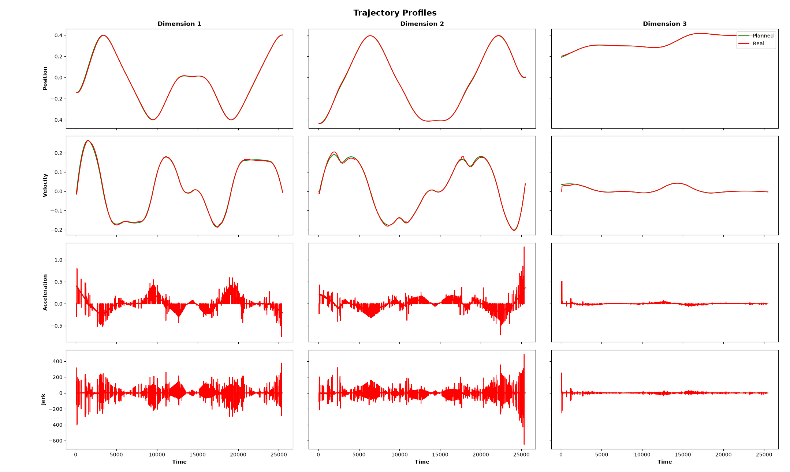

# Spline Planner

This project aims to create a planner for interpolating path points using Catmull-Rom splines and B-splines.

---

## Technological Stack

- **C++:** For planner and executor codes
- **Docker:** For easier operability on different devices
- **FORTRAN:** For spline libraries to be used for interpolation
- **RTDE:** For handling communication with UR robots
- **URSim:** For testing and validation with UR robots

---

## Usage
The following steps need to be performed:
1. Complete the [post installation steps for Docker](https://docs.docker.com/engine/install/linux-postinstall/) and allow connections to the host's X server.
    ```
    xhost +local:docker
    ```
1. Clone the project repository.
    ```
    git clone https://github.com/ShUbHkHaNdElWaL493/Spline-Planner.git spline_planner
    cd spline_planner
    ```
2. Check the `.env` file to ensure the parameters match the target parameters.
    ```
    BUILD_TYPE=Debug # Debug, Release
    UR_SERIES=e-series # cb3, e-series
    UR_MODEL=UR5e # UR3, UR3e, UR5, UR5e, UR10, UR10e, UR20, UR30
    ```
3. Start up the containers. Wait for the URSim container to finish setting up.
    ```
    docker compose up --build -d
    ```
4. Run the `spline_planner` program. Currently, it uses predefined points but they can be changed.
    ```
    docker exec -it spline_planner ./spline_planner
    ```

---

## Progress
The following things have been done:
1. The planner works successfully and provides a smooth trajectory for the path.
2. The executor works perfectly on the C++ simulator and follows the path perfectly.
3. The executor deviates a bit from the path on URSim and the PID values need to be checked.

---

## Trajectory Profiles



---

## Contributions
If you want to contribute to this project, feel free to mail me.